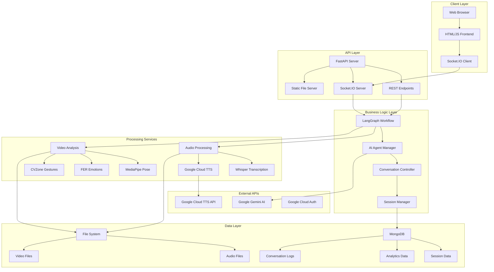
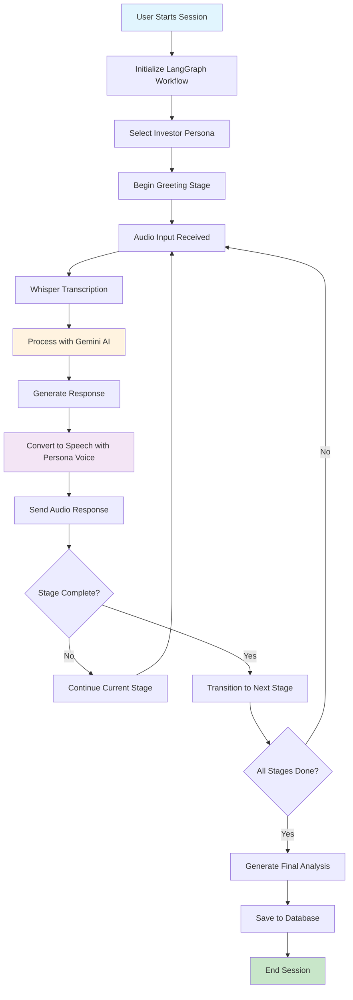
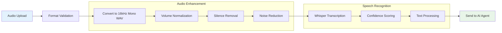
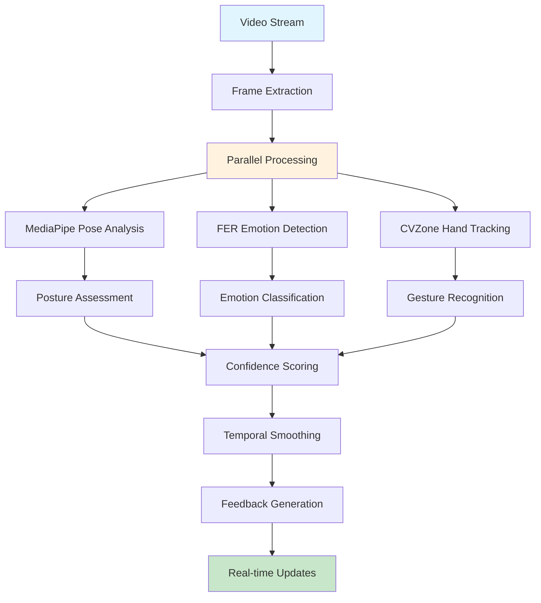
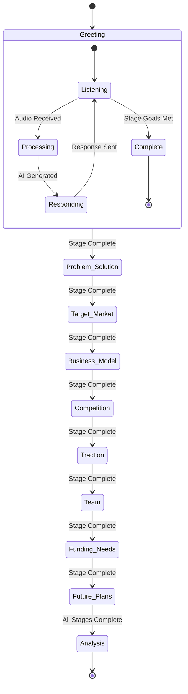
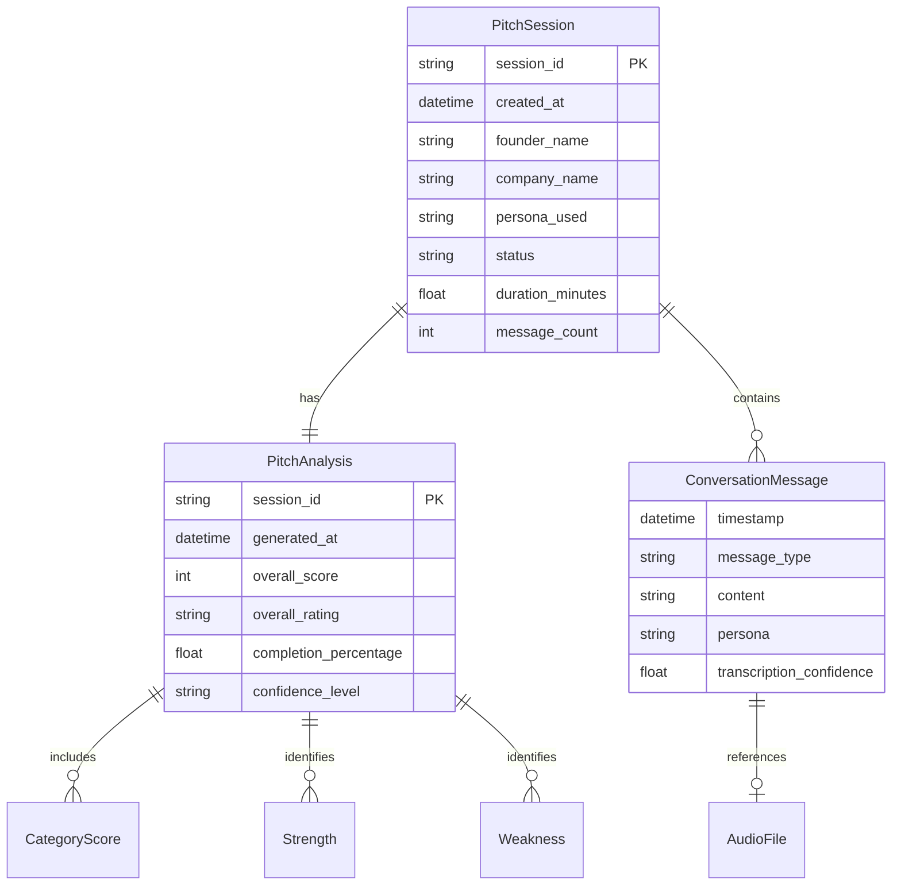

# AI Mock Investor Pitch - Technical Documentation

> **📋 Note**: This documentation contains Mermaid diagrams. For best viewing experience, use:
> - GitHub (native support)
> - GitLab (native support) 
> - VS Code with Mermaid Preview extension
> - Any Markdown viewer with Mermaid support

## Table of Contents
- [Overview](#overview)
- [Technologies and Tools](#technologies-and-tools)
- [AI Models Used](#ai-models-used)
- [System Architecture](#system-architecture)
- [Workflow Diagrams](#workflow-diagrams)
- [Detailed Component Analysis](#detailed-component-analysis)
- [Performance Considerations](#performance-considerations)

## Overview

The AI Mock Investor Pitch application is a sophisticated multimodal system that simulates real investor pitch sessions. It combines advanced AI models, real-time audio/video processing, and intelligent conversation management to provide entrepreneurs with realistic pitch practice experiences.

---

## Technologies and Tools

### 🚀 Core Framework & Web Technologies

| Technology | Version | Purpose |
|------------|---------|---------|
| **FastAPI** | v0.115.12 | Modern, fast web framework with automatic API documentation |
| **Socket.IO** | v5.13.0 | Real-time bidirectional communication for live features |
| **Uvicorn** | v0.34.3 | High-performance ASGI server |
| **Jinja2** | v3.1.6 | Template engine for HTML rendering |
| **CORS Middleware** | - | Cross-origin resource sharing support |

### 🤖 AI & Machine Learning Frameworks

| Technology | Version | Purpose |
|------------|---------|---------|
| **Google Generative AI** | v0.8.5 | Primary AI engine (Gemini models) |
| **LangChain** | v0.3.15 | LLM application framework |
| **LangGraph** | v0.2.65 | State machine for AI workflows |
| **OpenAI Whisper** | v20240930 | Speech recognition and transcription |

### 🎵 Audio Processing & Speech Technologies

| Technology | Version | Purpose |
|------------|---------|---------|
| **Google Cloud TTS** | v2.27.0 | Professional text-to-speech synthesis |
| **LibROSA** | v0.10.2 | Audio analysis and feature extraction |
| **PyDub** | v0.25.1 | Audio manipulation and format conversion |
| **SoundFile** | v0.12.1 | Audio file I/O operations |
| **NoiseReduce** | v3.0.3 | Background noise reduction |
| **WebRTC VAD** | v2.0.10 | Voice activity detection |

### 👁️ Computer Vision & Video Analysis

| Technology | Version | Purpose |
|------------|---------|---------|
| **OpenCV** | v4.10.0.84 | Computer vision and video processing |
| **MediaPipe** | v0.10.20 | Multimodal perception (pose, hands) |
| **CVZone** | v1.6.1 | Simplified computer vision utilities |
| **FER** | v22.5.1 | Facial expression recognition |
| **TensorFlow** | v2.19.0 | Machine learning framework backend |
| **MoviePy** | v1.0.3 | Video editing and processing |

### 🗄️ Database & Persistence

| Technology | Version | Purpose |
|------------|---------|---------|
| **MongoDB** | - | NoSQL document database |
| **Motor** | v3.7.1 | Async MongoDB driver |
| **PyMongo** | v4.13.2 | Synchronous MongoDB driver |
| **Pydantic** | v2.11.6 | Data validation and serialization |

---

## AI Models Used

### 🧠 Primary AI Model - Google Gemini

```yaml
Model: gemini-2.5-flash-lite-preview-06-17
Provider: Google Generative AI
Configuration:
  temperature: 0.7
  convert_system_message_to_human: true
Purpose: Main conversational AI for investor responses
```

### 🎤 Speech Recognition - OpenAI Whisper

```yaml
Available Models:
  - tiny: Fastest, basic accuracy
  - base: Balanced speed/accuracy
  - small: Default, good accuracy ⭐
  - medium: Higher accuracy, slower
  - large: Best accuracy, slowest

Default Configuration:
  model_size: small
  language: en (auto-detection available)
  temperature: 0.2
  beam_size: 5
  best_of: 5
```

### 🗣️ Text-to-Speech - Google Cloud Neural Voices

#### Skeptical Persona (Sarah Martinez)
```yaml
Voice: en-US-Neural2-F
Gender: Female
Characteristics: Professional, authoritative
Settings:
  speaking_rate: 0.95
  pitch: -2.0
  volume_gain_db: 0.0
```

#### Technical Persona (Dr. Alex Chen)
```yaml
Voice: en-US-Neural2-D
Gender: Male
Characteristics: Enthusiastic, knowledgeable
Settings:
  speaking_rate: 1.1
  pitch: 1.0
  volume_gain_db: 0.0
```

#### Friendly Persona (Michael Thompson)
```yaml
Voice: en-US-Neural2-C
Gender: Female
Characteristics: Warm, supportive
Settings:
  speaking_rate: 1.0
  pitch: 2.0
  volume_gain_db: 0.0
```

### 👁️ Computer Vision Models

#### MediaPipe Pose
```yaml
Model Complexity: 1
Detection Confidence: 0.7
Tracking Confidence: 0.5
Purpose: Body posture and gesture analysis
```

#### FER Emotion Recognition
```yaml
Backend: MTCNN or default face detection
Emotions: Happy, Sad, Angry, Fear, Surprise, Disgust, Neutral
Purpose: Real-time facial emotion analysis
```

#### CVZone Hand Tracking
```yaml
Max Hands: 2
Model Complexity: 1
Detection Confidence: 0.7
Tracking Confidence: 0.5
Purpose: Hand gesture recognition
```

---

## System Architecture



---

## Workflow Diagrams

### 🎯 Main Pitch Session Workflow



### 🎤 Audio Processing Pipeline



### 🎬 Video Analysis Workflow



### 🤖 LangGraph State Machine



### 💾 Database Schema Relationships



---

## Detailed Component Analysis

### 🎭 Investor Persona System

#### Skeptical Investor (Sarah Martinez)
- **Background**: Senior VC Partner, ex-McKinsey consultant
- **Approach**: Data-driven, evidence-focused questioning
- **Decision Triggers**: 
  - Concrete traction metrics
  - Validated business model
  - Clear path to profitability
- **Red Flags**: 
  - Vague answers about metrics
  - Unvalidated assumptions
  - Lack of customer evidence

#### Technical Investor (Dr. Alex Chen)
- **Background**: Former Google Principal Engineer, CTO-turned-investor
- **Approach**: Architecture-first, scalability-focused analysis
- **Decision Triggers**: 
  - Novel technical approach
  - Strong technical team
  - Scalable architecture
- **Red Flags**: 
  - Weak technical foundation
  - Non-scalable architecture
  - Technically inexperienced team

#### Friendly Investor (Michael Thompson)
- **Background**: Angel investor, former entrepreneur
- **Approach**: Story-driven, founder-focused evaluation
- **Decision Triggers**: 
  - Passionate founder with clear vision
  - Strong team dynamics
  - Compelling origin story
- **Red Flags**: 
  - Lack of passion or conviction
  - Poor team dynamics
  - Unclear vision

### 🔄 Pitch Stages Management

```mermaid
gantt
    title Pitch Session Timeline
    dateFormat X
    axisFormat %s
    
    section Stage 1
    Greeting & Rapport Building    :0, 120
    
    section Stage 2
    Problem & Solution            :120, 300
    
    section Stage 3
    Target Market Analysis        :300, 480
    
    section Stage 4
    Business Model Discussion     :480, 660
    
    section Stage 5
    Competition Analysis          :660, 840
    
    section Stage 6
    Traction & Metrics           :840, 1020
    
    section Stage 7
    Team Background              :1020, 1200
    
    section Stage 8
    Funding Requirements         :1200, 1380
    
    section Stage 9
    Future Plans & Vision        :1380, 1560
```



### 📊 Analytics and Scoring System

#### Category Scoring (0-100 scale)
- **Engagement Score**: Talk/listen ratio, conversation balance
- **Fluency Score**: Grammar, vocabulary, filler words
- **Interactivity Score**: Question responses, conversation turns
- **Content Quality**: Depth, clarity, evidence provided

#### Overall Rating System
- **Vertx Assured** (90-100): Exceptional performance
- **Good** (75-89): Strong performance with minor improvements
- **Satisfactory** (60-74): Adequate with room for growth
- **Below Average** (40-59): Needs significant improvement
- **Need to Improve** (0-39): Requires major development

---

## Performance Considerations

### ⚡ Optimization Strategies

#### Async Architecture
```python
# Non-blocking I/O operations
async def process_audio_async(audio_data):
    transcription = await transcribe_audio(audio_data)
    response = await generate_ai_response(transcription)
    audio_response = await synthesize_speech(response)
    return audio_response
```

#### Connection Pooling
```python
# Efficient database connections
client = AsyncIOMotorClient(
    connection_string,
    maxPoolSize=10,
    minPoolSize=1,
    serverSelectionTimeoutMS=10000
)
```

#### Caching Strategy
- **Model Loading**: Cache Whisper models in memory
- **Voice Synthesis**: Cache common responses
- **Database Queries**: Cache session data during active sessions

#### Resource Management
- **Audio Files**: Automatic cleanup after processing
- **Video Streams**: Efficient frame processing with configurable intervals
- **Memory Usage**: Optimized for concurrent sessions

### 📈 Scalability Features

#### Horizontal Scaling
- Stateless API design
- Database connection pooling
- Load balancer ready

#### Performance Monitoring
- Request/response timing
- Model inference latency
- Database query performance
- Real-time session metrics

---

## API Endpoints Reference

### 🔗 Core Endpoints

| Method | Endpoint | Purpose |
|--------|----------|---------|
| `GET` | `/` | Main application interface |
| `POST` | `/pitch` | Process audio pitch submission |
| `GET` | `/api/database/test` | Test database connectivity |
| `GET` | `/api/database/status` | Get database status |

### 🔌 Socket.IO Events

| Event | Direction | Purpose |
|-------|-----------|---------|
| `connect` | Client → Server | Establish connection |
| `start_session` | Client → Server | Initialize pitch session |
| `audio_data` | Client → Server | Stream audio data |
| `video_frame` | Client → Server | Send video frame |
| `ai_response` | Server → Client | Send AI response |
| `analysis_update` | Server → Client | Real-time feedback |

---

## Environment Configuration

### 🔧 Required Environment Variables

```bash
# AI Models
GEMINI_API_KEY=your_gemini_api_key
GEMINI_MODEL=gemini-2.5-flash-lite-preview-06-17
WHISPER_MODEL_SIZE=small

# Google Cloud TTS
TYPE=service_account
PROJECT_ID=your_project_id
PRIVATE_KEY_ID=your_private_key_id
PRIVATE_KEY=your_private_key
CLIENT_EMAIL=your_client_email
CLIENT_ID=your_client_id
AUTH_URI=https://accounts.google.com/o/oauth2/auth
TOKEN_URI=https://oauth2.googleapis.com/token

# Database
MONGODB_URL=mongodb://localhost:27017
DATABASE_NAME=pitch_simulator
DISABLE_MONGODB=false
```

---

## Deployment Architecture

### 🐳 Docker Configuration

```dockerfile
FROM python:3.11-slim

# Install system dependencies
RUN apt-get update && apt-get install -y \
    ffmpeg \
    libsndfile1 \
    && rm -rf /var/lib/apt/lists/*

# Install Python dependencies
COPY requirements.txt .
RUN pip install -r requirements.txt

# Copy application code
COPY . /app
WORKDIR /app

# Expose port
EXPOSE 8000

# Start application
CMD ["uvicorn", "main:app", "--host", "0.0.0.0", "--port", "8000"]
```

### ☁️ Cloud Deployment

```yaml
# cloudbuild.yaml
steps:
- name: 'gcr.io/cloud-builders/docker'
  args: ['build', '-t', 'gcr.io/$PROJECT_ID/pitch-simulator', '.']
- name: 'gcr.io/cloud-builders/docker'
  args: ['push', 'gcr.io/$PROJECT_ID/pitch-simulator']
```

---

## Troubleshooting Guide

### 🔍 Common Issues

#### Audio Processing Issues
- **FFmpeg not found**: Install FFmpeg and add to PATH
- **Audio format errors**: Ensure WAV/MP3 format compliance
- **Transcription failures**: Check Whisper model availability

#### Database Connection Issues
- **MongoDB connection timeout**: Verify connection string and network access
- **Authentication errors**: Check MongoDB credentials
- **Collection access errors**: Verify database permissions

#### AI Model Issues
- **Gemini API errors**: Verify API key and quota limits
- **TTS synthesis failures**: Check Google Cloud credentials
- **Model loading errors**: Ensure sufficient memory and disk space

---

## Future Enhancements

### 🚀 Planned Features

- **Multi-language Support**: Extend to support non-English pitches
- **Advanced Analytics**: ML-powered performance insights
- **Custom Personas**: User-defined investor personalities
- **Integration APIs**: Third-party CRM and analytics platforms
- **Mobile App**: Native mobile application
- **Real-time Collaboration**: Multi-user pitch sessions

---

*Generated on: 2024*  
*Version: 1.0*  
*Documentation maintained by: AI Pitch Simulator Team*